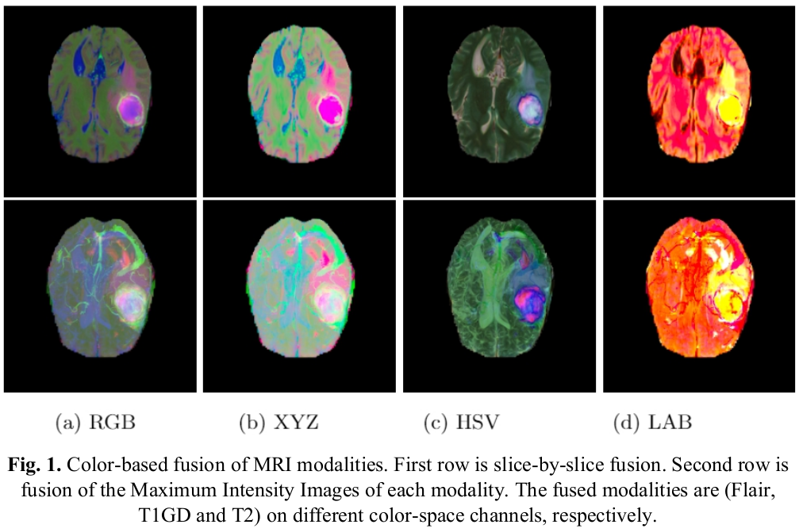

# Color-based Fusion of MRI Modalities for Brain Tumor Segmentation

This repo contains the implementation code for our paper "Color-based Fusion of MRI Modalities for Brain Tumor Segmentation" presented at MICAD2021.

<p align="center">

</p>

## Prerequisites: 
* Pytorch (tested on v. 1.7.1)
* python (tested on v. 3.8)
* cuda (tested on v. 11.0)

## Getting started: 
* clone this repo. 
 ```
 git clone https://github.com/Nachwa/Color-MRI-Seg.git
 ```
* Downlaod BRATS from MICCAI dataset

## For training: 
Run the following command
```
python train.py  --db_dir ROOT_PATH_BRATS --save_batches
```
--save_batches: saves the processed batches to be reused from the second iteration. 

## For Testing: 
Run the following command
```
python test.py  --db_dir ROOT_PATH_BRATS 
```


## Paper: 
The paper will be presentated at MICAD2021 [Video presentation](https://youtu.be/e11A7ikxS9c?t=3337), 
[Paper](https://hal.archives-ouvertes.fr/hal-03174069/document)
